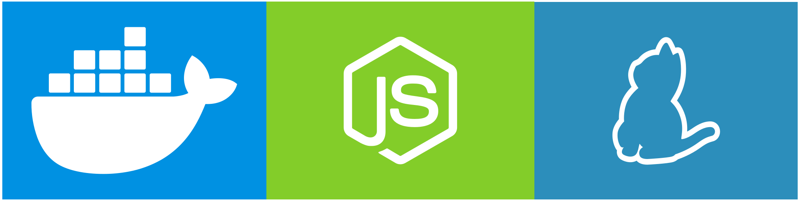

# Vendee


TVM-Solidity contract development framework


## Requirements



* [Docker](https://www.docker.com) to run [node simple emulator](https://github.com/tonlabs/evernode-se)
* [yarn](https://yarnpkg.com) to initialize project

## Development

### Build and run cli script

```shell
yarn cli
```

### Build

```shell
yarn build
```

### Remove build directory

```shell
yarn clean
```

### Lint

Run before commit

```shell
yarn lint
```

```shell
yarn fix
```