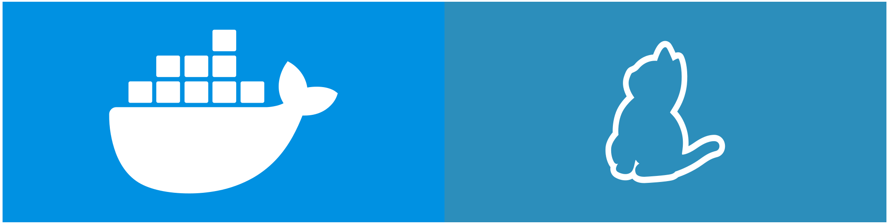

# Vascoo


TVM-Solidity contract development framework

[](https://www.npmjs.com/package/vasku)
[](https://www.npmjs.com/package/vasku)

## Initialize project

```shell
npx vasku@latest
```

## Features 

* Project initialization
* Contract compilation
* Contract TypeScript wrapping
* [Simple Emulator](https://github.com/tonlabs/evernode-se) wrapper
* [Mocha](https://mochajs.org) and [Chai](https://www.chaijs.com) testing
* Giver management
* Running custom scripts
* Ability to use contracts without changes on server side and in browser
* Interactive console

## Requirements



* [Docker](https://www.docker.com) to run [node Simple Emulator](https://github.com/tonlabs/evernode-se)
* [Nodejs](https://nodejs.org)
* [yarn](https://yarnpkg.com) to initialize project

## Documentation

[source](https://github.com/savonarolagirolamo/vasku-docs)

## Examples

* [vasku-example](https://github.com/savonarolagirolamo/vasku-example) - simple example of using Vascoo for contract compilation, testing and deployment published as [npm package](https://www.npmjs.com/package/vasku-example)
* [vasku-example-web](https://github.com/savonarolagirolamo/vasku-example-web) - simple example of using [vasku-example](https://github.com/savonarolagirolamo/vasku-example) in web

## Tools

* [vasku-keys](https://github.com/savonarolagirolamo/vasku-keys) - methods of working with key pair

## Contributing

* [Read CONTRIBUTING.md](./CONTRIBUTING.md) to view development commands
* [Open an issue](https://github.com/savonarolagirolamo/vasku/issues/new) if you want report a bug or make a suggestion
* **Make a pull request** if you want to add something
